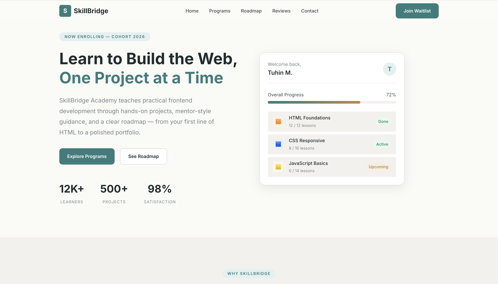
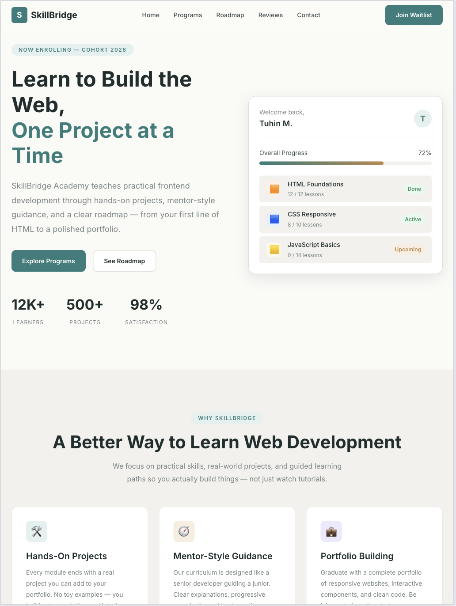
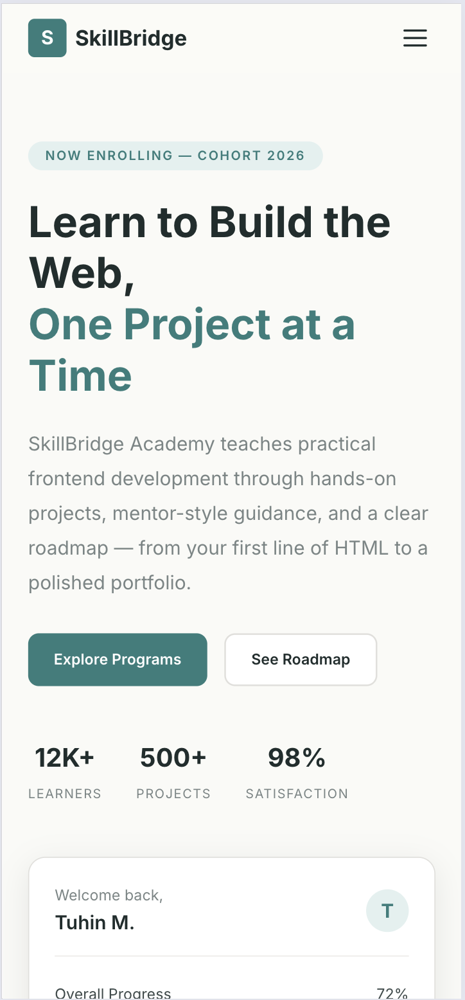

# SkillBridge Academy — Responsive Frontend Interface

> **DecodeLabs Full Stack Development Internship — Project 1**

SkillBridge Academy is a fully responsive frontend interface built using **HTML5**, **CSS3**, and **vanilla JavaScript**. The project focuses on clean UI design, mobile-first responsiveness, semantic structure, accessibility, and basic frontend interactivity.

---

## 📋 Project Objective

The objective of this project is to create a responsive frontend interface for a simple web application using only frontend fundamentals.

### DecodeLabs Project 1 Requirements Covered

| Requirement                                  | Implementation                                                       |
| -------------------------------------------- | -------------------------------------------------------------------- |
| Use HTML, CSS, and basic JavaScript          | Built with HTML5, CSS3, and vanilla JavaScript                       |
| Responsive layout for different screen sizes | Mobile-first design with tablet and desktop breakpoints              |
| Clean and user-friendly UI                   | Professional landing page with clear sections and consistent spacing |
| Frontend development basics                  | Semantic HTML, reusable CSS, DOM interactions                        |
| Responsive design basics                     | CSS Grid, Flexbox, media queries, relative units                     |
| UI basics                                    | Visual hierarchy, cards, CTA buttons, forms, FAQ, testimonials       |

---

## ✨ Features

* **Responsive Layout** — Mobile-first CSS with breakpoints at 768px and 1024px
* **Sticky Navbar** — Clean header with desktop navigation and mobile hamburger menu
* **Hero Section** — Headline, CTA buttons, stats, and a CSS-only dashboard mockup
* **About Section** — Cards explaining hands-on projects, mentor-style guidance, and portfolio building
* **Programs Section** — Six program cards covering HTML, CSS, JavaScript, UI/UX, projects, and career readiness
* **Learning Roadmap** — Four-step journey from basics to portfolio publishing
* **Interactive Demo** — JavaScript-powered learning goal selector with dynamic recommendations
* **Testimonials** — Student review cards with ratings
* **FAQ Accordion** — Expand/collapse FAQ section using vanilla JavaScript
* **Contact Form** — Client-side validation with inline error messages and success state
* **Scroll Reveal Animations** — Smooth entrance animations using Intersection Observer
* **Smooth Scrolling** — Navigation links scroll smoothly to sections
* **Accessible Structure** — Semantic tags, form labels, ARIA attributes, and visible focus states

---

## 🛠️ Tech Stack

| Technology      | Purpose                                |
| --------------- | -------------------------------------- |
| HTML5           | Semantic page structure                |
| CSS3            | Styling, responsive layout, animations |
| JavaScript ES6+ | DOM manipulation and interactivity     |
| Google Fonts    | Typography                             |

> No frontend frameworks or UI libraries such as React, Vue, Tailwind, Bootstrap, or jQuery were used.

---

## 📁 Folder Structure

```txt
task-1-tuhin-mondal/
├── index.html
├── styles.css
├── script.js
├── README.md
├── .gitignore
└── screenshots/
    ├── desktop.png
    ├── tablet.png
    └── mobile.png
```

---

## 🚀 How to Run Locally

1. Clone the repository:

```bash
git clone https://github.com/YOUR_USERNAME/task-1-tuhin-mondal.git
cd task-1-tuhin-mondal
```

2. Open the project:

You can directly open `index.html` in your browser.

Or run it using a local server:

```bash
python3 -m http.server 8080
```

Then visit:

```txt
http://localhost:8080
```

No installation or build step is required.

---

## 📱 Responsive Design

The layout follows a mobile-first approach.

| Screen Size | Behavior                                             |
| ----------- | ---------------------------------------------------- |
| Mobile      | Single-column layout, hamburger menu, stacked cards  |
| Tablet      | Two-column layouts for selected sections             |
| Desktop     | Full navigation, two-column hero, multi-column cards |

Responsive techniques used:

* CSS Grid for card layouts
* Flexbox for navigation and alignment
* Media queries at 768px and 1024px
* Relative units such as `rem`, `%`, and `clamp()`
* No horizontal overflow on small screens

---

## ⚙️ JavaScript Functionality

| Feature          | Description                                                    |
| ---------------- | -------------------------------------------------------------- |
| Mobile Menu      | Opens and closes the navigation menu on small screens          |
| FAQ Accordion    | Expands one FAQ at a time with ARIA support                    |
| Interactive Demo | Updates recommendation content based on selected learning goal |
| Form Validation  | Validates name, email, interest, and message length            |
| Scroll Reveal    | Animates sections when they enter the viewport                 |
| Header Effect    | Adds visual change to navbar on scroll                         |
| Smooth Scroll    | Smoothly scrolls to page sections                              |

---

## 📸 Screenshots

### Desktop View



### Tablet View



### Mobile View



---

## 🌐 Live Demo

Live Site: https://nextgendev2029.github.io/task-1-tuhin-mondal/

---

## 👤 Author

**Tuhin Mondal**
DecodeLabs Full Stack Development Internship — 2026
Project 1: Responsive Frontend Interface

---

<p align="center">
  <em>Built for DecodeLabs Project 1 — Responsive Frontend Interface</em>
</p>
